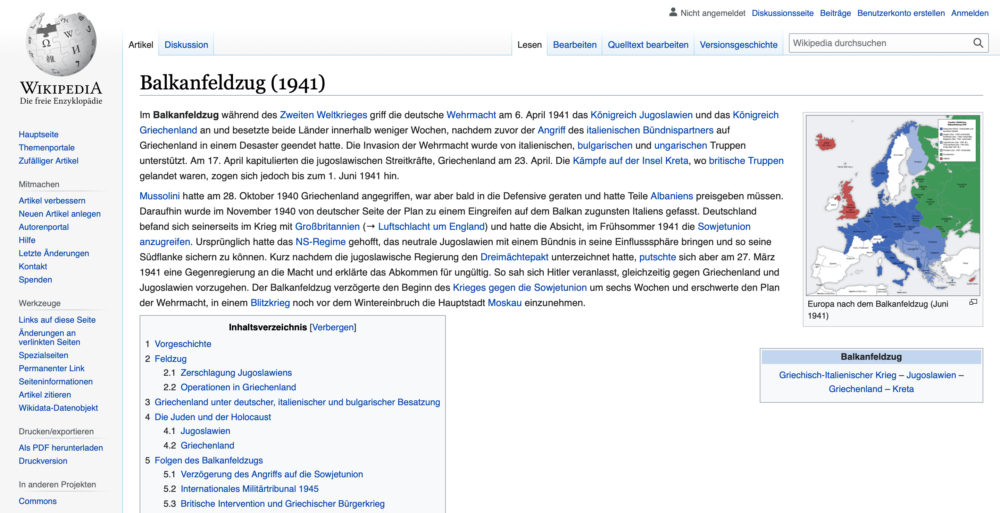

# Random Wikipedia walker

Using Selenium, create a small program that, starting from the main page https://www.wikipedia.org/, walks trough a sequence of random links and takes a snapshot of the last page.
The process is as follows:

 1. Navigate to the main page https://www.wikipedia.org/
 2. Select a random link in the page
 3. Navigate to the link
 4. Repeat steps 2 to 3 until you have visited 10 different pages
 5. Take a snapshot of the current page and save it

Include the code of the walker and the snapshot in this document.

## Answer

````java
public class TestWikipedia {

    private WebDriver driver;
    private final long SLEEP_TIME = 1000;

    @Before
    public void setUp() {
        driver = new SafariDriver();
        driver.manage().window().maximize();
    }

    @After
    public void tearDown() {
        driver.quit();
    }

    @Test
    public void navigateThroughWikipedia() throws InterruptedException {
        // Home page of Wikipedia
        driver.get("https://www.wikipedia.org/");
        Thread.sleep(SLEEP_TIME);

        Random r = new Random();
        // Select a language
        List<WebElement> elements = driver.findElements(By.className("link-box"));
        elements.get(r.nextInt(elements.size())).click();
        Thread.sleep(SLEEP_TIME);

        // Navigate through href links of wikipedia
        for (int i = 0; i < 10; i++) {
            elements = driver.findElements(By.xpath("//a[contains(@href,'/wiki/')]"));
            try {
                elements.get(r.nextInt(elements.size())).click();
                Thread.sleep(SLEEP_TIME);
            } catch (Exception ignored) {}
        }

        // Screenshot of the last page
        File screenshot = ((TakesScreenshot)driver).getScreenshotAs(OutputType.FILE);
        try {
            FileUtils.copyFile(screenshot, new File("screenshot.png"));
        } catch (Exception e) {
            e.printStackTrace();
        }
    }
}
````
Après avoir parcouru 10 pages, on arrive sur une page aléatoire de Wikipédia. Pour éviter de sortir de ``wikipedia.org``, nous avons ajouté un filtre pour ne cliquer que sur les liens internes.

